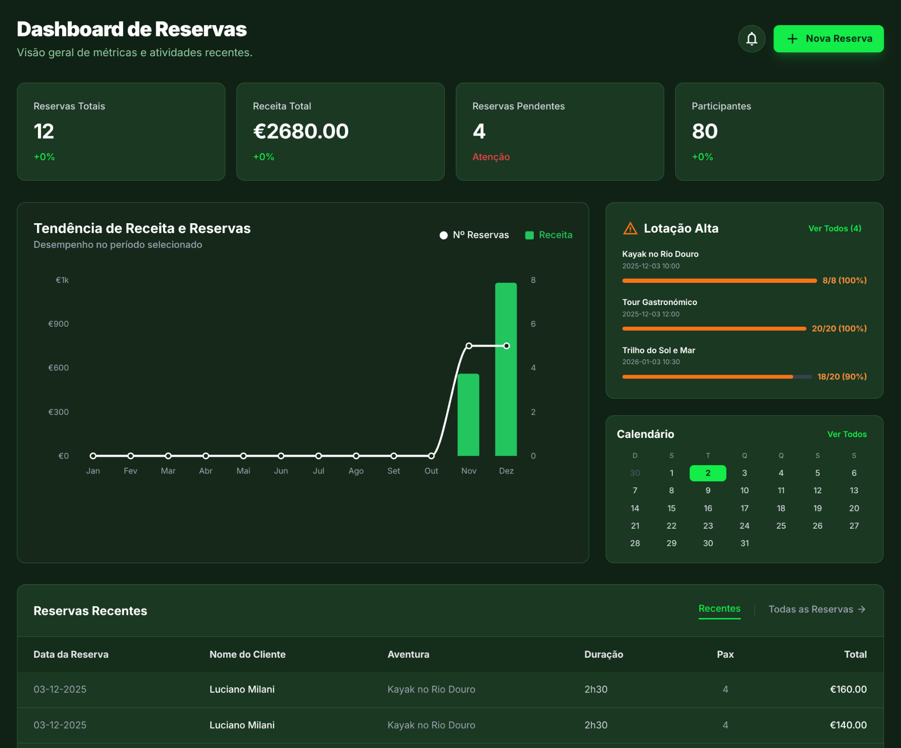
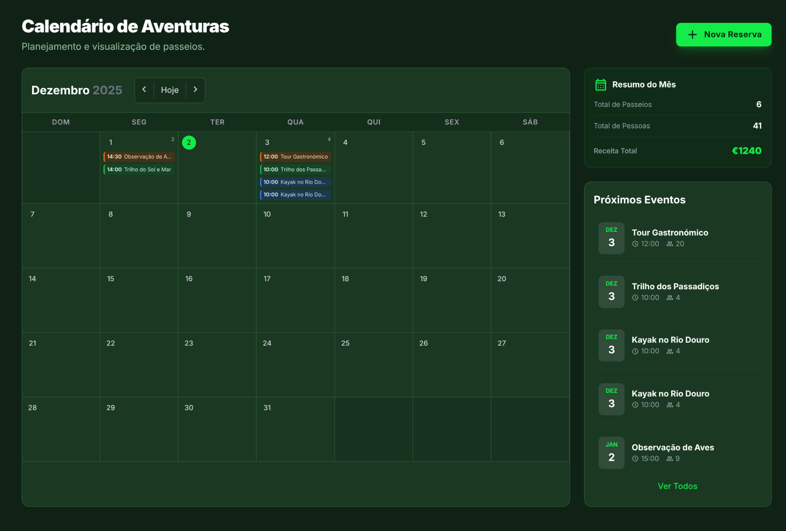

<div align="center">
  <h1>🌍 GestãoTour</h1>
  
  <h3>Plataforma Inteligente para Gestão de Turismo e Experiências</h3>

  <br />

  <!-- Banner Principal: Dashboard (Produto Real) -->
  

  <br /><br />

  [](https://nodejs.org/)
  [](https://ai.google.dev/)
  []()
  [](https://supabase.com/)

  <p>
    <a href="https://ai.studio/apps/drive/1Q90Vp4q7NmqyltY9Rk4eshYc2iUKGlou">
      <b>🔗 Visualizar App no Google AI Studio</b>
    </a>
  </p>
</div>

---

## 📖 Visão Geral

O **GestãoTour** é uma solução "All-in-One" projetada para modernizar agências de turismo e organizadores de eventos. Focada em performance e UX (Experiência do Usuário), a plataforma substitui planilhas complexas por uma interface visual intuitiva.

O sistema utiliza Inteligência Artificial para auxiliar na tomada de decisão, monitoramento de receita e gestão de capacidade em tempo real.

---

## 🖥️ Destaques da Interface

### 📊 Cockpit de Gestão (Visível no Topo)
O painel principal oferece uma visão macro do negócio.
*   **KPIs em Tempo Real:** Receita Total, Reservas Pendentes e Taxa de Ocupação.
*   **Analytics:** Gráficos de tendência para identificar picos de venda (Sazonalidade).
*   **Alertas de Lotação:** Avisos visuais automáticos quando um tour atinge capacidade crítica.

<br>

### 🗓️ Calendário de Aventuras
Organização visual completa para o dia a dia. A visualização mensal permite arrastar e gerenciar eventos com facilidade.
*   **Status Color-Coded:** Identificação rápida de tipos de passeios (Gastronômico, Aventura, Relaxamento).
*   **Painel Lateral:** Resumo rápido dos próximos eventos e previsões de receita do mês.

<div align="center">
  <!-- Certifique-se de que a imagem calendar.png está na pasta assets -->
  
</div>

---

## ✨ Funcionalidades Principais

*   **🌑 Dark Mode Nativo:** Interface moderna que reduz a fadiga visual e destaca as informações críticas com acentos em verde neon.
*   **💰 Controle Financeiro:** Monitoramento preciso de entradas (€), com distinção clara entre reservas pagas e pendentes.
*   **🧠 Integração AI (Gemini):** Otimização de roteiros e sugestões baseadas no histórico de reservas.
*   **👥 Gestão de Participantes:** Controle granular de vagas (ex: 18/20 vagas preenchidas).

---

## 🛠️ Tech Stack

Construído sobre uma arquitetura moderna e escalável:

*   **Frontend:** React / Next.js
*   **Estilização:** Tailwind CSS (Design System)
*   **Backend & Auth:** Supabase (PostgreSQL)
*   **AI Engine:** Google Gemini API

---

## ⚡ Quick Start

Traga a operação para sua máquina local em minutos seguindo estas etapas.

### 1. Clonar Repositório
Baixe o código fonte para sua máquina:

```bash
git clone https://github.com/lucianomilani/gestaotour.git
cd gestaotour
2. Instalar Dependências
Instale as bibliotecas necessárias listadas no package.json:
code
Bash
npm install
3. Configurar Variáveis (.env.local)
Crie um arquivo chamado .env.local na raiz do projeto e insira suas credenciais:
code
Env
# Chaves de API
GEMINI_API_KEY=sua_chave_aqui
NEXT_PUBLIC_SUPABASE_URL=sua_url
NEXT_PUBLIC_SUPABASE_ANON_KEY=sua_chave
4. Executar
Inicie o servidor de desenvolvimento local:
code
Bash
npm run dev
Acesse o projeto em seu navegador: http://localhost:3000
🤝 Contribuição
Contribuições são bem-vindas! Se você tem ideias para novos módulos ou melhorias no dashboard, siga o fluxo abaixo:
Faça um Fork do projeto.
Crie uma Branch para sua funcionalidade (git checkout -b feature/NovaFuncionalidade).
Commit suas mudanças (git commit -m 'feat: Adiciona gráfico de churn').
Faça o Push para a Branch (git push origin feature/NovaFuncionalidade).
Abra um Pull Request.
<div align="center">
<sub>Desenvolvido por <a href="https://github.com/lucianomilani">Luciano Milani</a></sub>
</div>
